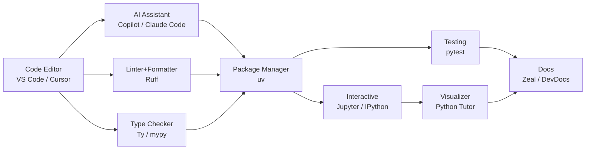

# 🐍 The Ultimate Python Roadmap: Zero to Senior Backend Developer (2026 Standard)

> *A comprehensive guide to mastering Core Python for Backend, System Design, and AI Agentic Workflows.*

Becoming a senior backend developer requires more than just knowing syntax. It requires a deep understanding of language internals, memory management, concurrency, design patterns, and the modern ecosystem. This roadmap is a complete, 2026-modern guide focusing on Core Python and its backend/AI ecosystem.

## 🛠️ Toolchain & Ecosystem (The 2026 Stack)

To maximize your learning speed and efficiency, we recommend a modern toolchain. Here is how these tools interact:

### 💡 Important Suggestions for Learning
- **Code Editor**: Use **VS Code** (with Pylance + Ruff extensions) or **Cursor** (built-in AI agent mode) as your daily driver.
- **Modern Python Tooling**: Adopt **uv** (lightning-fast package manager) and **Ruff** (blazing-fast linter and formatter) instead of legacy tools like `pip`, `black`, or `flake8`.
- **Interactive Learning**: Use **JupyterLab** or **IPython** to test concepts line-by-line, which is especially helpful for complex topics like OOP or generators.
- **Visualization**: Utilize [Python Tutor](https://pythontutor.com/) to visualize code execution step-by-step, helping you understand references, closures, and the call stack.
- **AI Assistance**: Treat AI tools like Claude Code or Cursor as your personal tutor. Ask them to explain concepts like a senior developer with real-world use cases.

---

## 🟢 Phase 1: Absolute Basics (Foundation Building)
*Core topics to build a strong foundation in Python syntax and logical thinking.*

### 1. Introduction & Setup
- **1.1 Python Installation & Environment Variables**:
  Setting up Python on your system and configuring paths.
- **1.2 IDE Setup (VSCode, PyCharm, Jupyter Notebooks)**:
  Choosing and configuring your development environment.
- **1.3 Python Execution Model**:
  Understanding how Python code translates to bytecode and runs on the Python Virtual Machine.
- **1.4 Virtual Environments (`venv`, `virtualenv`, `uv`)**:
  Isolating project dependencies to avoid conflicts.
- **1.5 Package Management (`pip`, `pip-tools`, `poetry`, `uv`)**:
  Installing and managing external libraries efficiently.

### 2. Basic Syntax & Semantics
- **2.1 Indentation Rules and PEP 8 Guidelines**:
  Writing clean, readable code following standard Python styling.
- **2.2 Comments and Docstrings**:
  Documenting code effectively for yourself and other developers.
- **2.3 Variables and Dynamic Typing**:
  How Python handles variable types at runtime without explicit declarations.
- **2.4 Basic I/O (`input()`, `print()` with formatting)**:
  Reading user input and outputting formatted text (like f-strings).

### 3. Primitive Data Types
- **3.1 Integers (`int`) and Floating Point (`float`)**:
  Handling whole and decimal numbers.
- **3.2 Boolean (`bool`) and `None` type**:
  Representing truth values and the absence of a value.
- **3.3 Strings (`str`)**:
  Manipulating text using built-in string methods.
- **3.4 Type Conversion & Casting**:
  Changing a variable's data type implicitly or explicitly.

### 4. Operators
- **4.1 Arithmetic Operators**:
  Performing math operations (addition, subtraction, modulo, etc.).
- **4.2 Comparison & Relational Operators**:
  Comparing values to return a boolean result.
- **4.3 Logical Operators (`and`, `or`, `not`)**:
  Combining multiple boolean expressions.
- **4.4 Bitwise Operators**:
  Manipulating data at the bit (binary) level.
- **4.5 Assignment & Walrus Operator (`:=`)**:
  Assigning values, including inline assignment for cleaner loops.

### 5. Control Flow
- **5.1 `if`, `elif`, `else` statements**:
  Making decisions in code based on conditions.
- **5.2 `while` loops**:
  Repeating a block of code as long as a condition is true.
- **5.3 `for` loops and `range()`**:
  Iterating over sequences like lists or generating number ranges.
- **5.4 Loop Control (`break`, `continue`, `pass`)**:
  Altering the flow of loops or creating empty placeholders.
- **5.5 Structural Pattern Matching (`match-case`)**:
  Advanced conditional logic introduced in Python 3.10.

### 6. Basic Data Structures
- **6.1 Lists**:
  Ordered, mutable collections of items.
- **6.2 Tuples**:
  Ordered, immutable collections, often used for fixed data.
- **6.3 Dictionaries**:
  Key-value pairs for fast lookups.
- **6.4 Sets**:
  Unordered collections of unique elements, great for mathematical operations.

### 7. Basic Functions
- **7.1 Defining functions (`def`)**:
  Creating reusable blocks of code.
- **7.2 Arguments (Positional, Keyword, Default)**:
  Passing data into functions flexibly.
- **7.3 `*args` and `**kwargs`**:
  Handling an arbitrary number of arguments.
- **7.4 Return values vs `None`**:
  Sending data back from a function to the caller.
- **7.5 Scope and Lifetime of Variables (LEGB Rule)**:
  Understanding Local, Enclosing, Global, and Built-in scopes.

---

## 🟡 Phase 2: Intermediate Python (OOP & Functional Concepts)
*Transitioning from simple scripts to modular, organized applications.*

### 8. Advanced Data Structures & Comprehensions
- **8.1 List Comprehensions**:
  Creating lists concisely in a single line.
- **8.2 Dict and Set Comprehensions**:
  Generating dictionaries and sets with compact syntax.
- **8.3 Generator Expressions**:
  Creating memory-efficient iterators dynamically.
- **8.4 Nested Data Structures**:
  Managing complex data like lists of dictionaries.
- **8.5 `collections` module**:
  Using specialized containers like `Counter`, `defaultdict`, and `deque`.

### 9. Object-Oriented Programming (OOP) Basics
- **9.1 Classes and Objects**:
  Blueprints and instances representing real-world entities.
- **9.2 `__init__` constructor and `self`**:
  Initializing object state and referencing the current instance.
- **9.3 Instance Variables vs Class Variables**:
  Data belonging to an object vs data shared across all instances.
- **9.4 Instance, Class, and Static Methods**:
  Different types of methods and when to use them.
- **9.5 Magic/Dunder Methods**:
  Overriding Python's built-in behavior (e.g., `__str__`, `__len__`).

### 10. OOP Principles (The 4 Pillars)
- **10.1 Encapsulation**:
  Restricting direct access to data using public, protected, and private modifiers.
- **10.2 Inheritance**:
  Creating new classes based on existing ones to reuse code.
- **10.3 Method Overriding and `super()`**:
  Redefining inherited methods and calling parent methods.
- **10.4 Polymorphism**:
  Using a single interface for different data types.
- **10.5 Abstraction**:
  Hiding complex implementation details using Abstract Base Classes (`abc`).

### 11. Advanced OOP Concepts
- **11.1 Multiple Inheritance and MRO**:
  Inheriting from multiple classes and understanding Method Resolution Order.
- **11.2 Mixins**:
  Using small classes to provide specific features to other classes.
- **11.3 Data Classes (`@dataclass`)**:
  Automatically generating boilerplate code for data-heavy classes.
- **11.4 Properties (`@property`)**:
  Managing attribute access, setting, and deletion cleanly.
- **11.5 Slots (`__slots__`)**:
  Optimizing memory usage by preventing the creation of `__dict__` for objects.

### 12. Error & Exception Handling
- **12.1 Syntax Errors vs Exceptions**:
  Distinguishing between invalid syntax and runtime errors.
- **12.2 `try`, `except`, `else`, `finally` blocks**:
  Safely handling potential errors without crashing the program.
- **12.3 Built-in Exceptions Hierarchy**:
  Understanding how Python categorizes standard errors.
- **12.4 Raising Custom Exceptions**:
  Creating your own error types for specific application logic.
- **12.5 Exception Chaining**:
  Linking exceptions to preserve the original error trace (`raise ... from ...`).

### 13. File Handling & Context Managers
- **13.1 Reading/Writing Text Files**:
  Opening, reading, modifying, and closing text files.
- **13.2 Working with CSV and JSON files**:
  Parsing and generating structured data formats.
- **13.3 Handling Binary Files**:
  Working with non-text data like images or compiled files.
- **13.4 Context Managers (`with` statement)**:
  Ensuring resources (like files) are automatically closed.
- **13.5 Custom Context Managers**:
  Creating your own managed resources using `__enter__` and `__exit__`.

### 14. Functional Programming Basics
- **14.1 Functions as First-Class Citizens**:
  Passing functions as arguments and returning them.
- **14.2 Lambda Functions**:
  Creating small, anonymous, one-line functions.
- **14.3 `map()`, `filter()`, `reduce()`**:
  Applying operations across iterables efficiently.
- **14.4 Closures**:
  Functions that remember the state of their enclosing scope.
- **14.5 Recursion vs Iteration**:
  Solving problems by having functions call themselves vs using loops.

---

## 🟠 Phase 3: Advanced Python (Internals & Performance)
*Understanding how Python works under the hood. Crucial for Senior Backend roles.*

### 15. Iterators & Generators
- **15.1 Iterator Protocol (`__iter__`, `__next__`)**:
  The mechanism behind Python's iteration.
- **15.2 Generators (`yield` keyword)**:
  Functions that pause execution and return multiple values lazily.
- **15.3 Generator Pipelines**:
  Chaining generators for highly efficient data processing.
- **15.4 `itertools` module**:
  Utilizing advanced iteration tools (combinations, permutations, etc.).
- **15.5 Memory efficiency**:
  Understanding why generators save memory compared to loaded lists.

### 16. Decorators
- **16.1 Higher-Order Functions**:
  Functions that accept or return other functions.
- **16.2 Basic Function Decorators**:
  Modifying or extending the behavior of a function dynamically.
- **16.3 Decorators with Arguments**:
  Passing custom parameters to your decorators.
- **16.4 Class Decorators**:
  Applying decorators to entire classes.
- **16.5 `functools.wraps`**:
  Preserving the original function's metadata when decorating.

### 17. Type Hinting & Static Analysis
- **17.1 Basic Type Hints**:
  Annotating variables for better readability and tooling support.
- **17.2 `typing` module**:
  Using advanced types like `Union`, `Optional`, and `Any`.
- **17.3 Type hinting Functions and Methods**:
  Defining expected argument types and return types.
- **17.4 Generic Types (`TypeVar`, `Generic`)**:
  Creating flexible, reusable types for containers.
- **17.5 Static Type Checkers (`mypy`, `pyright`, `ty`)**:
  Catching type-related bugs before runtime.

### 18. Memory Management & Internals
- **18.1 CPython Architecture**:
  How the default Python implementation operates.
- **18.2 Memory Allocation**:
  Understanding the Stack vs the Heap in Python.
- **18.3 Reference Counting**:
  Python's primary method for tracking object usage.
- **18.4 Garbage Collection**:
  Finding and cleaning up circular references using the `gc` module.
- **18.5 Profiling Memory Leaks**:
  Tracking down memory bloat using tools like `tracemalloc`.

### 19. Metaprogramming
- **19.1 Everything is an Object**:
  Understanding the fundamental `type` object.
- **19.2 Metaclasses**:
  Creating classes that define the behavior of other classes.
- **19.3 `__new__` vs `__init__`**:
  Object creation versus object initialization.
- **19.4 Monkey Patching**:
  Modifying code behavior at runtime dynamically.
- **19.5 Dynamic modification**:
  Modifying classes and functions programmatically.

### 20. Time Complexity & Optimization
- **20.1 Big O Notation**:
  Evaluating algorithmic efficiency (e.g., List `pop(0)` vs `deque.popleft()`).
- **20.2 Complexity of Data Structures**:
  Knowing the speed of operations for dictionaries vs lists.
- **20.3 Algorithmic optimization**:
  Choosing the right algorithm for the right problem.
- **20.4 Profiling code**:
  Measuring execution time using `cProfile` and `timeit`.

---

## 🔴 Phase 4: Concurrency, Parallelism & Networking
*Handling multiple tasks efficiently—the core of robust backend development.*

### 21. Concurrency vs Parallelism
- **21.1 Definitions**:
  Managing multiple things at once vs doing multiple things at exactly the same time.
- **21.2 I/O Bound vs CPU Bound tasks**:
  Knowing whether your bottleneck is waiting for data or pure computation.
- **21.3 Choosing the right approach**:
  Deciding between threads, processes, or async based on the workload.

### 22. Multithreading
- **22.1 `threading` module**:
  Creating lightweight threads within a single process.
- **22.2 Thread lifecycle**:
  Managing the states of a thread from start to finish.
- **22.3 Thread Synchronization**:
  Preventing race conditions using Locks and Semaphores.
- **22.4 Event objects and Conditions**:
  Coordinating complex operations across multiple threads.
- **22.5 Thread Pools**:
  Reusing a pool of threads efficiently using `ThreadPoolExecutor`.

### 23. Multiprocessing
- **23.1 `multiprocessing` module**:
  Spawning separate OS processes to bypass the GIL.
- **23.2 Process memory space**:
  Understanding isolated memory vs shared memory.
- **23.3 Inter-process Communication (IPC)**:
  Passing data between processes using Pipes and Queues.
- **23.4 Process Pools**:
  Managing parallel CPU-heavy workloads via `ProcessPoolExecutor`.

### 24. Asyncio (Asynchronous Programming)
- **24.1 Event Loop concept**:
  The core engine that manages async execution.
- **24.2 Coroutines and `async`/`await`**:
  Writing non-blocking code that looks synchronous.
- **24.3 Tasks and Futures**:
  Scheduling and tracking the state of async operations.
- **24.4 Async I/O**:
  Performing file and network operations without blocking the thread.
- **24.5 Synchronization primitives**:
  Managing concurrent access in async code.

### 25. Networking Fundamentals
- **25.1 OSI Model and Sockets**:
  Understanding the basics of network communication.
- **25.2 `socket` module**:
  Building low-level TCP/UDP servers and clients.
- **25.3 Handling multiple connections**:
  Concepts behind scalable networking (Select, Epoll).
- **25.4 HTTP Protocol internals**:
  Deep dive into Requests, Headers, Methods, and Status Codes.
- **25.5 WebSockets protocol**:
  Establishing persistent, two-way communication channels.

### 26. Subprocesses & OS Interaction
- **26.1 `os` module**:
  Interacting with the operating system, environment variables, and paths.
- **26.2 `sys` module**:
  Accessing Python runtime parameters and standard streams.
- **26.3 `subprocess` module**:
  Running external system commands and scripts safely.
- **26.4 Pipes and redirections**:
  Capturing output from system commands directly in Python.

---

## 🟣 Phase 5: Backend Ecosystem & System Design
*Essential concepts for building scalable applications.*

### 27. Modern Python Tooling (2026 Standard)
- **27.1 `uv` package manager**:
  Using the fastest Rust-based package installer.
- **27.2 `Ruff` linter/formatter**:
  Keeping code clean instantly.
- **27.3 `rye` or `poetry`**:
  Managing complex project dependencies.
- **27.4 Pre-commit hooks**:
  Enforcing code quality checks automatically before committing.

### 28. Database Interactions (Core Level)
- **28.1 DBAPI 2.0 specification**:
  The standard for Python database drivers.
- **28.2 `psycopg2` / `psycopg3`**:
  Connecting to and interacting with PostgreSQL.
- **28.3 Connection Pooling**:
  Reusing database connections to handle high traffic.
- **28.4 Transaction management**:
  Ensuring data integrity using ACID properties.
- **28.5 Parameterized queries**:
  Writing raw SQL securely to prevent injection attacks.

### 29. ORM Foundations (SQLAlchemy Core)
- **29.1 Engine and Connection setup**:
  Configuring database connections via SQLAlchemy.
- **29.2 Metadata and Table definitions**:
  Mapping database tables to Python structures.
- **29.3 SQL Expression Language**:
  Writing complex queries using Python syntax.
- **29.4 Executing queries**:
  Retrieving and manipulating database records via proxies.

### 30. Caching Mechanisms
- **30.1 `functools.lru_cache`**:
  Adding in-memory caching to function calls instantly.
- **30.2 Memcached/Redis integration**:
  Connecting to external caching servers (`redis-py`).
- **30.3 Cache invalidation strategies**:
  Knowing when and how to expire old cache data.
- **30.4 Distributed caching**:
  Scaling cache layers across multiple servers.

### 31. Message Queues & Background Tasks
- **31.1 Message Brokers**:
  Understanding concepts behind RabbitMQ, Kafka, or Redis.
- **31.2 `Celery` architecture**:
  Setting up robust background task processing.
- **31.3 Task definitions and workers**:
  Executing heavy tasks outside the main request cycle.
- **31.4 Task scheduling**:
  Running cron-like jobs using `Celery Beat`.
- **31.5 APScheduler**:
  Implementing lightweight asynchronous background tasks.

### 32. API Design Principles
- **32.1 RESTful principles**:
  Building standard, resource-oriented HTTP APIs.
- **32.2 GraphQL concepts**:
  Allowing clients to query exactly the data they need.
- **32.3 gRPC and Protocol Buffers**:
  High-performance RPC frameworks for microservices.
- **32.4 API Versioning**:
  Managing changes to your API without breaking existing clients.
- **32.5 Rate limiting & Pagination**:
  Protecting your servers and handling large datasets.

### 33. Security in Backend
- **33.1 OWASP Top 10 prevention**:
  Guarding against the most common web vulnerabilities.
- **33.2 Password Hashing**:
  Storing credentials securely using `bcrypt` or `argon2`.
- **33.3 JWT and OAuth2 flows**:
  Managing modern authentication and authorization.
- **33.4 CORS**:
  Handling cross-origin requests securely.
- **33.5 Secure deserialization**:
  Avoiding catastrophic vulnerabilities caused by `pickle`.

---

## ⚫ Phase 6: Software Architecture & Design Patterns
*Thinking logically and architecturally like a Senior Engineer.*

### 34. SOLID Principles in Python
- **34.1 Single Responsibility**:
  Classes should have only one reason to change.
- **34.2 Open/Closed**:
  Code should be open for extension but closed for modification.
- **34.3 Liskov Substitution**:
  Subclasses must be substitutable for their base classes.
- **34.4 Interface Segregation**:
  Clients shouldn't depend on interfaces they don't use.
- **34.5 Dependency Inversion**:
  Depending on abstractions rather than concretions.

### 35. Creational Design Patterns
- **35.1 Singleton**:
  Ensuring a class has only one instance (and understanding its threading risks).
- **35.2 Factory Method & Abstract Factory**:
  Creating objects without specifying their exact classes.
- **35.3 Builder Pattern**:
  Constructing complex objects step-by-step.
- **35.4 Prototype Pattern**:
  Cloning existing objects rather than creating new ones.

### 36. Structural Design Patterns
- **36.1 Adapter Pattern**:
  Allowing incompatible interfaces to work together.
- **36.2 Bridge Pattern**:
  Decoupling abstractions from their implementations.
- **36.3 Decorator Pattern**:
  Adding responsibilities to objects dynamically (Gang of Four design).
- **36.4 Facade Pattern**:
  Providing a simplified interface to a complex system.
- **36.5 Proxy Pattern**:
  Providing a placeholder to control access to another object (e.g., lazy loading).

### 37. Behavioral Design Patterns
- **37.1 Observer Pattern (Pub/Sub)**:
  Notifying multiple objects about state changes.
- **37.2 Strategy Pattern**:
  Encapsulating family of algorithms and making them interchangeable.
- **37.3 Command Pattern**:
  Turning a request into a standalone object.
- **37.4 Iterator Pattern**:
  Accessing elements of a collection sequentially.
- **37.5 State Pattern**:
  Allowing an object to alter its behavior when its state changes.

### 38. Architectural Patterns
- **38.1 Monolithic vs Microservices**:
  Understanding the trade-offs between unified vs distributed systems.
- **38.2 Repository Pattern**:
  Abstracting data access logic away from business logic.
- **38.3 Unit of Work Pattern**:
  Managing multiple repository operations in a single transaction.
- **38.4 Clean/Hexagonal Architecture**:
  Structuring applications to isolate the core domain logic.
- **38.5 Event-Driven Architecture (EDA)**:
  Building systems that react to state-changing events.

### 39. Domain-Driven Design (DDD)
- **39.1 Entities vs Value Objects**:
  Differentiating between objects with identity and purely descriptive objects.
- **39.2 Aggregates**:
  Grouping related objects that must be treated as a single unit.
- **39.3 Repositories and Factories**:
  Managing the lifecycle and retrieval of domain objects.
- **39.4 Bounded Contexts**:
  Defining explicit boundaries for domain models.

---

## 🟤 Phase 7: Testing, CI/CD & DevOps
*Delivering reliable, production-ready software.*

### 40. Unit Testing
- **40.1 `unittest` framework**:
  Using Python's built-in testing library.
- **40.2 `pytest` framework**:
  Leveraging the modern standard for writing concise and powerful tests.
- **40.3 Fixtures and Conftest.py**:
  Reusing setup and teardown code seamlessly.
- **40.4 Parameterized testing**:
  Running the same test logic with multiple sets of data.
- **40.5 Mocking and Patching**:
  Isolating external dependencies using `unittest.mock`.

### 41. Advanced Testing Concepts
- **41.1 Test Coverage**:
  Measuring how much of your code is executed during tests (`pytest-cov`).
- **41.2 Integration Testing**:
  Verifying that multiple components work together properly.
- **41.3 Load Testing**:
  Simulating high traffic using tools like `locust`.
- **41.4 Property-Based Testing**:
  Generating massive amounts of test data using `Hypothesis`.
- **41.5 Contract Testing**:
  Ensuring microservices communicate correctly without breaking each other.

### 42. Logging & Monitoring
- **42.1 `logging` module**:
  Configuring Handlers, Formatters, and Loggers for structured output.
- **42.2 Structured Logging**:
  Emitting logs as JSON for easier parsing (`structlog`).
- **42.3 Distributed Tracing**:
  Tracking requests across microservices (OpenTelemetry).
- **42.4 Metrics collection**:
  Gathering performance data for tools like Prometheus.
- **42.5 Error Tracking**:
  Automatically capturing unhandled exceptions via Sentry.

### 43. CI/CD Pipelines
- **43.1 GitHub Actions**:
  Automating testing and deployment workflows.
- **43.2 GitLab CI/CD**:
  Building pipelines using GitLab's native tools.
- **43.3 Automating checks**:
  Running `ruff` and `mypy` on every commit.
- **43.4 Dockerizing Python**:
  Packaging applications into lightweight containers with multi-stage builds.
- **43.5 Semantic Versioning**:
  Managing release cycles predictably.

---

## 🔵 Phase 8: AI, Data Engineering & Agentic Workflows (2026 Focus)
*Modern integrations for the AI era.*

### 44. Data Manipulation & Processing
- **44.1 `NumPy` basics**:
  Using arrays and vectorization for fast numerical computations.
- **44.2 `Pandas`**:
  Analyzing and manipulating data using DataFrames.
- **44.3 Data transformation**:
  Cleaning raw data to make it usable.
- **44.4 Handling large datasets**:
  Processing data efficiently using chunking or Dask.
- **44.5 Parquet and Arrow**:
  Working with high-performance columnar data formats.

### 45. Vector Databases & Embeddings
- **45.1 Vector Embeddings**:
  Transforming text into numerical representations.
- **45.2 Integrating Vector DBs**:
  Storing and querying vectors in Pinecone, Milvus, or Qdrant.
- **45.3 Similarity concepts**:
  Understanding Cosine Similarity and Euclidean Distance.
- **45.4 HNSW indexing**:
  The algorithms powering fast vector searches.

### 46. LLM Integration Basics
- **46.1 Calling LLM APIs**:
  Communicating with OpenAI, Anthropic, or Gemini via Python SDKs or `httpx`.
- **46.2 Tokenization**:
  Managing context window limits dynamically.
- **46.3 Prompt Engineering in code**:
  Structuring robust prompts directly within Python logic.
- **46.4 Streaming LLM responses**:
  Receiving and processing generated text in real-time.
- **46.5 Rate limiting & Fallbacks**:
  Building resilient API integrations.

### 47. Agentic AI Workflows (Senior Level)
- **47.1 AI Agents & ReAct**:
  Understanding the Reasoning and Acting paradigm.
- **47.2 Function Calling / Tool Use**:
  Allowing LLMs to execute pure Python code.
- **47.3 Custom Agents**:
  Building multi-step reasoning loops entirely from scratch.
- **47.4 Framework Comparisons**:
  Weighing LangChain vs LlamaIndex vs purely Custom Code.
- **47.5 Memory management**:
  Implementing short-term conversation context and long-term storage.

### 48. RAG (Retrieval-Augmented Generation)
- **48.1 Document parsing**:
  Extracting text from PDFs, HTML, and Markdown.
- **48.2 Text splitting**:
  Dividing documents via Semantic or Recursive chunking.
- **48.3 Embedding models**:
  Generating high-quality vectors for search.
- **48.4 Retrieval strategies**:
  Implementing Hybrid Search and Re-ranking for better accuracy.
- **48.5 RAG Evaluation**:
  Benchmarking pipeline performance using RAGAS concepts.

---

## 🟤 Phase 9: Modern Python Features (3.12 to 3.14+)
*Staying ahead of the curve with cutting-edge syntax and internals.*

### 49. Recent Syntax Additions
- **49.1 Structural Pattern Matching**:
  Deep dives into complex `match-case` logic.
- **49.2 Exception Groups (`except*`)**:
  Handling multiple simultaneous errors natively.
- **49.3 `TaskGroup`**:
  Managing asyncio task failures gracefully.
- **49.4 Type Parameter Syntax**:
  Using the new `type` statement for cleaner generics.
- **49.5 `@override` decorator**:
  Ensuring method overrides are statically verified.

### 50. Performance & Future of Python (2026+)
- **50.1 Faster CPython**:
  Understanding the ongoing specialization and GC improvements.
- **50.2 No-GIL / Free-Threaded Python (PEP 703)**:
  The revolutionary shift enabling true multithreading.
- **50.3 JIT Compiler**:
  How the Just-In-Time compiler speeds up Python 3.13+.
- **50.4 Subinterpreters (PEP 734)**:
  Implementing isolated parallelism mechanisms.
- **50.5 Rust Extensions (`PyO3`)**:
  Writing blazing-fast modules directly in Rust.
- **50.6 WebAssembly (Wasm)**:
  Running Python environments on the edge or directly in the browser via Pyodide.

---
*Stay consistent, use the tools to your advantage, and tackle this journey phase by phase. Happy Coding! 🚀*
